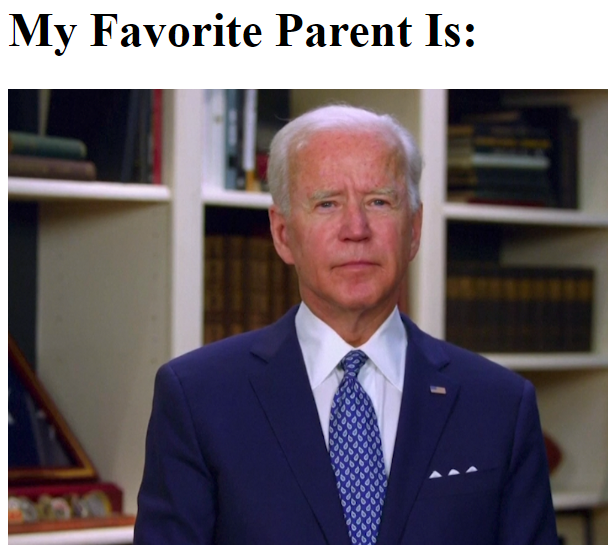

# Chases_Favorite_Parent

For a time, I would crack jokes to my parents that I was the favorite child.  One of my parents didn't think this was as funny as I thought it was, and asked me to stop... Fine!  I can stop...  But I can't promise that I'm going to handle it like a well rounded & mature adult!

Chases_Favorite_Parent is a silly self-hosted Python Flask app that searches a directory (say, a directory full of pictures of your parents) for a random image and displays it:

The random component is intentional so that the app remains relatively innocent/cheeky.  

---

# How to use

## Prepare Your Images

Have a directory (and know it's directory path) with your images handy.

For this example, I am using `C:\Users\cwest\OneDrive\Desktop\images`.

Replace `C:\Users\GoingOffRoading\images` with your directory path 

If you don't mount a folder for images, there's a couple default images that will show to proof of concept the container.

## Run the container

Download the container image:

`docker pull ghcr.io/goingoffroading/chases_favorite_parent:latest`

Run the container: 

`docker run  --volume=C:\Users\cwest\OneDrive\Desktop\images:/app/static/images -p 5000:5000 -d ghcr.io/goingoffroading/chases_favorite_parent:latest`

## How about Kubernetes?

See the attached `kubernetes_deployment_example.yml` 

Note:

- This container is using Traefik as a reverse proxy and is leveraging LetsEncrypt for it's certificate.  More info on how to this up is [in the Traefik development docs](https://doc.traefik.io/traefik/user-guides/crd-acme/)
- I'm not using a PV/PVC and instead just using an NFS mount... Because I am lazy
- NodeSelector is not present on the config, but will need to be there if you use localhost for image hosting

# What if I want to modify the HTML for 'my-favorite-sibling' or 'my-favorite-child' or 'my_favoite_cat'?

That makes us bothers.

When you run the container, change these environmental variables as needed:

| Variable | Type | Default | Notes |
|-----------------|-----------------|-----------------|-----------------|
| APP_TITLE   | String    | 'My Favorite Parent'    | This is what will appear in the browser tab label    |
| APP_HEADING    | String    | 'My Favorite Parent Is:'    | This is what will appear above the image rendered on the page    |
